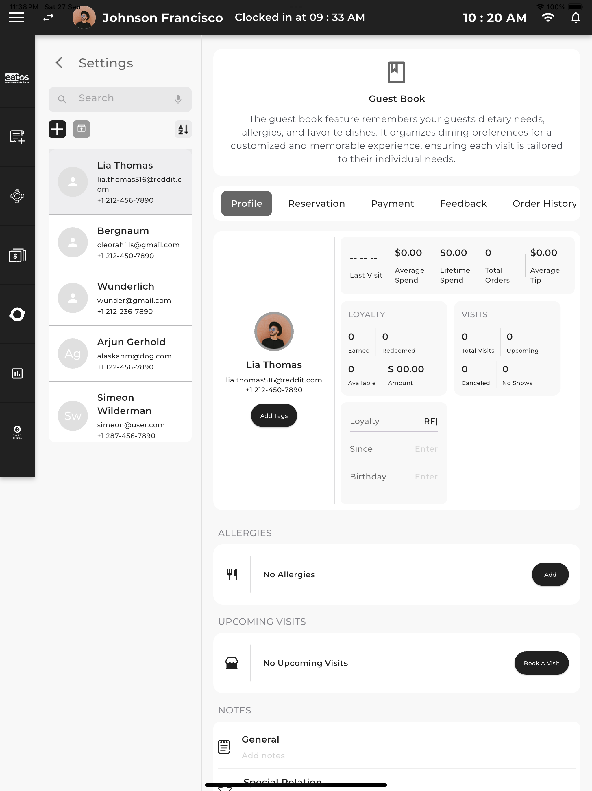
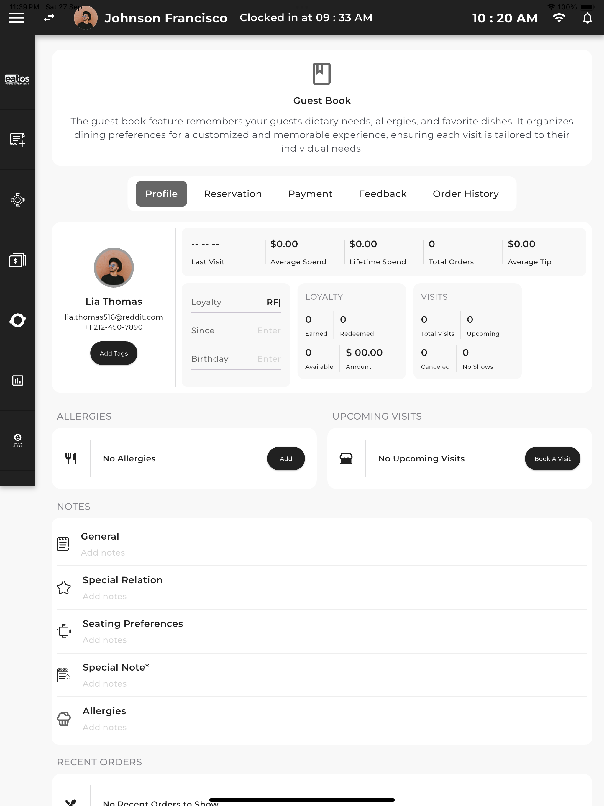

# Guest book

## 📋 Prerequisites

- Flutter SDK (^3.35.4)
- Dart SDK
- Android Studio / VS Code with Flutter extensions
- Android SDK / Xcode (for iOS development)

## 🛠️ Installation

1. Install dependencies:
```bash
flutter pub get
```

2. Run the application:
```bash
flutter run
```

## 📸 Screenshots

<table>
  <tr>
    <td></td>
    <td></td>
    <td></td>
  </tr>
</table>
